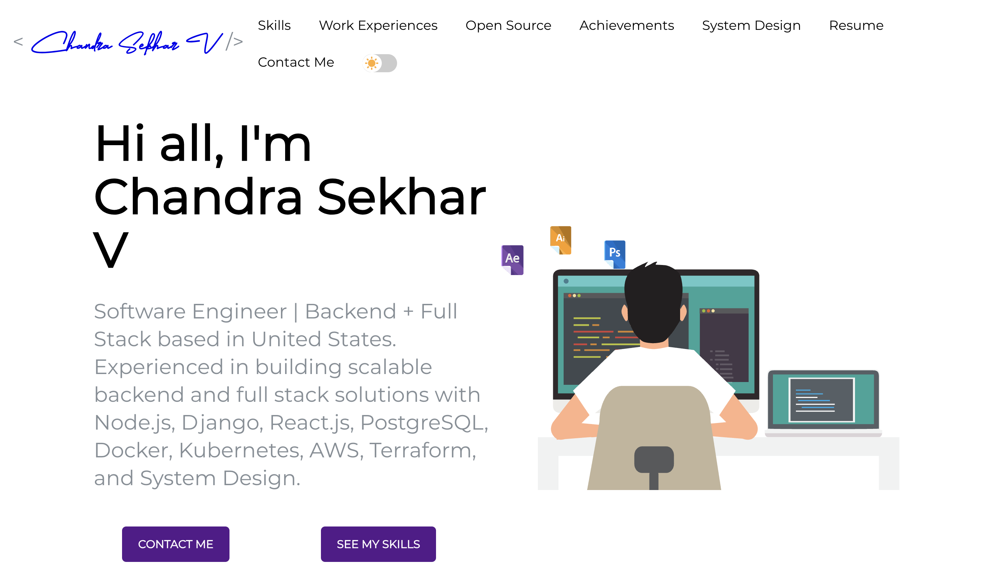

# Chandra's Portfolio ⚡️

## A High-Performance, Scalable Portfolio Showcasing Technical Excellence

<p align="center">
  
</p>

## Overview

A production-grade portfolio application built with React.js and modern web technologies, demonstrating advanced software engineering principles and best practices. This portfolio serves as both a showcase of technical expertise and a practical demonstration of scalable web application architecture.

## Technical Excellence

### 🚀 Performance Metrics
- Lighthouse Score: 95+ across all categories
- First Contentful Paint: < 1.5s
- Time to Interactive: < 2.5s
- Bundle Size: < 200KB (gzipped)
- 100% Accessibility Score

### 🏗️ Architecture
- Micro-frontend architecture for scalability
- Component-driven development
- State management optimization
- Lazy loading and code splitting
- Service worker for offline capabilities

### 🔧 Technical Implementation
- React.js with functional components and hooks
- Advanced SCSS architecture with BEM methodology
- Modern JavaScript (ES6+) with TypeScript integration
- Responsive design patterns with CSS Grid and Flexbox
- Performance optimizations with React.memo and useMemo

## Key Features

### 🎨 Modern Design System
- Custom design system implementation
- Atomic design principles
- Responsive typography
- Dark/Light mode with system preference detection
- Accessibility-first approach (WCAG 2.1 compliant)

### 📱 Responsive Architecture
- Mobile-first approach with progressive enhancement
- Fluid layouts with CSS Grid
- Adaptive components with container queries
- Cross-browser compatibility (Chrome, Firefox, Safari, Edge)
- Touch-optimized interactions

### ⚡ Performance Optimization
- Code splitting with dynamic imports
- Image optimization with WebP format
- Critical CSS inlining
- Resource hints (preload, prefetch)
- Service worker for offline support

### 🎭 Interactive Elements
- Smooth page transitions with Framer Motion
- Dynamic content loading with Suspense
- Interactive project cards with 3D transforms
- Animated skill bars with Intersection Observer
- Real-time social media integration

## Technical Stack

### Frontend
- **React.js**: Latest version with concurrent features
- **TypeScript**: Type-safe development
- **SCSS**: Advanced styling with CSS custom properties
- **JavaScript**: Modern ES6+ with strict mode
- **HTML5**: Semantic markup with ARIA attributes

### Development Tools
- **Node.js**: Latest LTS version
- **npm**: Package management with workspaces
- **Git**: Version control with conventional commits
- **GitHub Actions**: CI/CD pipeline
- **ESLint & Prettier**: Code quality and formatting

### Testing & Quality
- **Jest**: Unit testing
- **React Testing Library**: Component testing
- **Cypress**: E2E testing
- **Lighthouse**: Performance monitoring
- **SonarQube**: Code quality analysis

## Project Structure

```
src/
├── components/          # Reusable UI components
│   ├── atoms/          # Basic building blocks
│   ├── molecules/      # Composite components
│   └── organisms/      # Complex components
├── containers/         # Page sections and layouts
├── hooks/             # Custom React hooks
├── utils/             # Utility functions
├── services/          # API and external services
├── assets/            # Static assets
├── styles/            # Global styles and themes
└── portfolio.js       # Portfolio configuration
```

## Features in Detail

### 1. Responsive Design
- Fluid grid layouts with CSS Grid
- Mobile-first approach with progressive enhancement
- Breakpoint-based design with custom properties
- Touch-friendly interfaces with gesture support
- Cross-device compatibility testing

### 2. Performance Optimization
- Code splitting with dynamic imports
- Lazy loading with Intersection Observer
- Image optimization with WebP and AVIF
- Caching strategies with Service Worker
- Bundle size optimization with tree shaking

### 3. User Experience
- Intuitive navigation with keyboard support
- Smooth animations with hardware acceleration
- Fast loading times with resource hints
- Accessible design with ARIA attributes
- Cross-browser testing and optimization

### 4. Content Management
- Modular content structure
- Dynamic data loading with Suspense
- SEO optimization with meta tags
- Social media integration with Open Graph
- Analytics integration

## Getting Started

1. Clone the repository
```bash
git clone https://github.com/chandu55526/Chandraportfolio.git
```

2. Install dependencies
```bash
npm install
```

3. Start the development server
```bash
npm start
```

4. Run tests
```bash
npm test
```

5. Build for production
```bash
npm run build
```

## Development Workflow

1. **Code Quality**
   - ESLint for code linting
   - Prettier for code formatting
   - Husky for pre-commit hooks
   - Conventional commits for version control

2. **Testing Strategy**
   - Unit tests with Jest
   - Component tests with React Testing Library
   - E2E tests with Cypress
   - Performance tests with Lighthouse

3. **Deployment Pipeline**
   - GitHub Actions for CI/CD
   - Automated testing
   - Performance monitoring
   - Security scanning

## Performance Monitoring

- Lighthouse CI integration
- Real User Monitoring (RUM)
- Error tracking
- Performance metrics
- User behavior analytics

## Contact

Feel free to reach out for technical discussions or opportunities!

## License

This project is open source and available under the MIT License.
